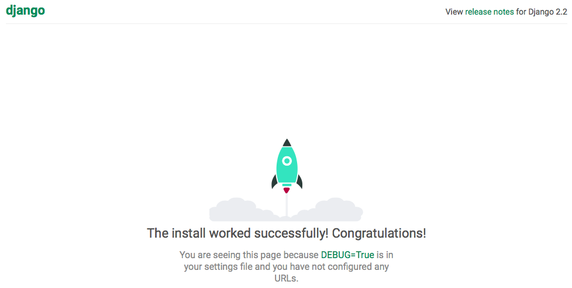

# django-rpi-tph-monitor
Home-automation with AI on Raspberry Pi and RIp TPH Monitor.

# about
This is integrated your home automation, control air-conditioner with AI and another infrared controlled devices such as television set or celling light and so on.

# prepare
You must get somethings next list.

* [Raspberry Pi][raspi] 3B, 3B+
* board
* micro SD card, 16GB above(recommended)
* USB connected key board
* USB connected mouse
* [Raspbian][raspbian]
* HDMI cable and display
  * use TV instead of display
* Python development environment
  * We supported only Python 3.7 upper version.

## Set up

### download newest Raspbian
We recommend using official Raspbian which can download from [Raspberry Pi Downloads][rpbod].  
You will choose "Raspbian Buster with desktop and recommended software" or
"Raspbian Buster with desktop".

### Installing operating system image
You must read [installation guide][ig] for installing operating system image.  
And download [balenaEtcher][etcher].

macOS  
```shell
$ brew cask install balenaetcher
```


### First boot
Only first boot time, You must connect USB keyboard, USB mouse, and monitor via HDMI.  
You must set Wi-Fi network and enable SSH via `raspbian-config`.  

#### Test remote connect

```shell
$ ssh pi@192.168.xxx.xxx
```

Package upgrade
```shell
$ sudo apt update
...
```

```shell
$ sudo apt upgrade
```
 
pyenv

# Development Application

## Prepare
Let's setup your Python development environment.

### Python additional modules

```shell
pip install Django
pip install djangorestframework
pip install markdown
pip install django-filter
pip install drf-yasg
```

### Atom IDE
You need additional installing for Atom [ide-python][idepy].

```shell
python -m pip install 'python-language-server[all]'
```

Or you can use `requirements.txt`.

```
pip install -r requirements.txt
```

## First step
Create your Django Project.

```shell
mkdir django-rpi-tph-monitor
cd django-rpi-tph-monitor
```

```shell
django-admin startproject tph
cd tph
```

```shell
python manage.py runserver
```
Access `http://localhost:8000/` on your browser.


## make 

```shell
Python manage.py startapp monitor
```

## Set up your data base
```shell
Python manage.py migrate
```

```shell
Operations to perform:
  Apply all migrations: admin, auth, contenttypes, sessions
Running migrations:
  Applying contenttypes.0001_initial... OK
  Applying auth.0001_initial... OK
  Applying admin.0001_initial... OK
  Applying admin.0002_logentry_remove_auto_add... OK
  Applying admin.0003_logentry_add_action_flag_choices... OK
  Applying contenttypes.0002_remove_content_type_name... OK
  Applying auth.0002_alter_permission_name_max_length... OK
  Applying auth.0003_alter_user_email_max_length... OK
  Applying auth.0004_alter_user_username_opts... OK
  Applying auth.0005_alter_user_last_login_null... OK
  Applying auth.0006_require_contenttypes_0002... OK
  Applying auth.0007_alter_validators_add_error_messages... OK
  Applying auth.0008_alter_user_username_max_length... OK
  Applying auth.0009_alter_user_last_name_max_length... OK
  Applying auth.0010_alter_group_name_max_length... OK
  Applying auth.0011_update_proxy_permissions... OK
  Applying sessions.0001_initial... OK
```

----
[raspi]: https://www.raspberrypi.org
[rpbod]: https://www.raspberrypi.org/downloads/
[raspbian]: https://www.raspbian.org
[ig]: https://www.raspberrypi.org/documentation/installation/installing-images/README.md
[etcher]: https://www.balena.io/etcher/
[idepy]: https://github.com/lgeiger/ide-python